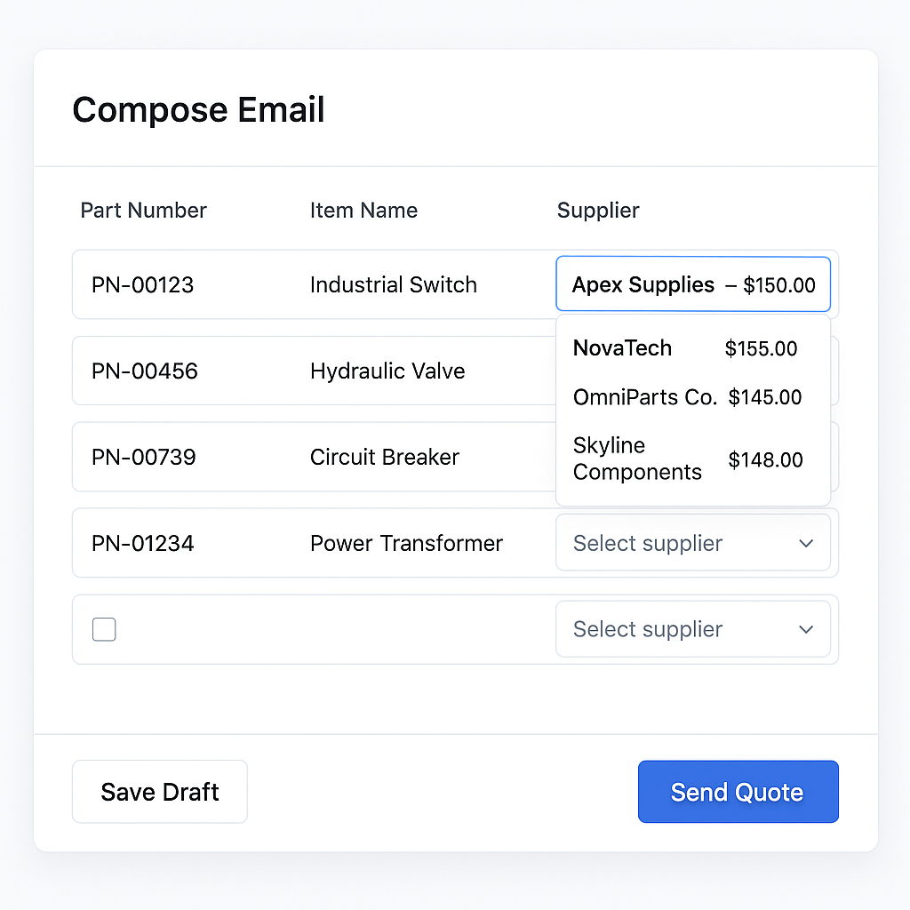

# RFQ Processor

A Python application for ingesting, parsing, and logging RFQ (Request For Quote) emails from an IMAP mailbox or `.eml` files. It supports attachment extraction (PDF, Excel), text normalization, deduplication using `Message-ID`, and embedding product data into a Postgres + `pgvector` database.

---

## Assumptions
- That SEWP format and others like it are 'structured' and little to no LLM interaction would be needed.
- The system would be parsing both static eml files and checking mail boxes.
- The system may be used in a threaded environment for scalability.

## Features
-  IMAP and `.eml` email ingestion
-  Deduplication via `Message-ID` and `MessageLogStore`
-  Attachment parsing: PDF, Excel (`.pdf`, `.xlsx`)
-  HTML + plain text email body cleaning
-  `sentence-transformers` for generating vector embeddings
-  PostgreSQL with `pgvector` extension support
-  Bulk supplier product data ingestion from CSV
-  Modular design with testable classes


## System Design Overview
This system is designed to automate the intake, parsing, and processing of RFQs (Requests for Quotation) received via email, and match them to the most relevant products from a supplier catalog using semantic and symbolic similarity.

## Architecture Summary:

### Email Ingestion: <a href="https://github.com/flrogerw/rfq-processor/blob/main/app/classes/EmailIngestor.py" style="font-size: 12px; font-weight:normal; ">(code sample)</a>
- Emails are ingested via IMAP or from .eml files. The EmailIngestor class handles deduplication using Message-ID and logs processed messages using MessageLogStore backed by PostgreSQL.

### Email Preprocessing: <a href="https://github.com/flrogerw/rfq-processor/blob/main/app/classes/EmailPreprocessor.py" style="font-size: 12px; font-weight:normal; ">(code sample)</a>
- The email body is cleaned (HTML stripped, forwarded headers removed), and attachments like PDFs or spreadsheets are parsed using pdfplumber and pandas. These contents are normalized into a single searchable block of text.

### Line Item Extraction:  <a href="https://github.com/flrogerw/rfq-processor/blob/main/app/parsers/sewp_bid_parser.py" style="font-size: 12px; font-weight:normal; ">(code sample)</a>
- Line items are extracted from email content or attachments. Each line item contains product name, part number, quantity, and optionally a delivery region.

### Hybrid Supplier Matching:  <a href="https://github.com/flrogerw/rfq-processor/blob/main/app/classes/HybridSupplierMatcher.py" style="font-size: 12px; font-weight:normal; ">(code sample)</a>
- The HybridSupplierMatcher class matches each RFQ line item to products in the supplier_products table using a hybrid scoring mechanism:

### Semantic similarity: <a href="https://github.com/flrogerw/rfq-processor/blob/59fa2ebfc965c01015de8695ec73b00a0b318678/app/classes/HybridSupplierMatcher.py#L55" style="font-size: 12px; font-weight:normal; ">(code sample)</a>
- Vector search using pgvector and sentence-transformers to compare item descriptions.

### Part number similarity: <a href="https://github.com/flrogerw/rfq-processor/blob/59fa2ebfc965c01015de8695ec73b00a0b318678/app/classes/HybridSupplierMatcher.py#L40" style="font-size: 12px; font-weight:normal; ">(code sample)</a>
- Exact and fuzzy string matching using trigram similarity (pg_trgm).

### Optional region filter: 
- If a delivery_region is specified, only products with a matching origin are considered.

All matching and scoring is done efficiently inside PostgreSQL to avoid expensive application-layer computation.

### Database & Extensions:
- The system uses PostgreSQL with the pgvector and pg_trgm extensions enabled. The schema includes suppliers, supplier_products, and rfq_logs tables for catalog storage, search, and auditing.

### Containerized Deployment:
- The full stack—including main processing scripts and Postgres with extensions—is packaged in Docker. The main pipeline runs in a container and shuts down cleanly after processing.

### Extensibility:
- The design is modular, with components like vector encoding, log storage, and product matching encapsulated in reusable classes. This allows the system to be extended with a UI layer, API, or scheduler for continuous operation.

---

## LLM Interaction Strategy   <a href="https://github.com/flrogerw/rfq-processor/blob/main/app/parsers/llm_bid_parser.py" style="font-size: 12px; font-weight:normal;">(code sample)</a>
The system is designed to extract meaningful, structured data from unstructured RFQ emails by leveraging an LLM (Large Language Model) in a controlled, modular pipeline.

### Extraction and Cleaning
Email content is ingested using the EmailIngestor class, which handles parsing via Python’s email library and deduplication via Message-ID. 

The EmailPreprocessor then performs several transformations:

- HTML and formatting cleanup using BeautifulSoup.

- Signature, reply, and forward-stripping using regex.

- Attachment parsing using pdfplumber (PDFs) and pandas (Excel).

- Normalization into a consolidated text block for the LLM.

### LLM Input Format
The cleaned and consolidated text is sent to the LLM in a prompt-structured format. For example:
```
You are a procurement assistant. Extract all RFQ line items from the following text, including:
- Product name
- Part number (if available)
- Quantity
- Delivery region (if specified)

Text:
"""
[consolidated email + attachment content]
"""
```
### Expected LLM Output Format
The LLM is expected to return a list of line items in structured JSON, such as:
```json
[
  {
    "name": "Cisco Catalyst Switch 9300",
    "part_number": "C9300-48P-A",
    "quantity": 12,
    "delivery_region": "United States"
  },
  {
    "name": "NCI Cluster Deployment - Starter Edition",
    "part_number": "CNS-INF-A-SVC-DEP-STR",
    "quantity": 34
  }
]
```

### Post-LLM Validation
Returned items are validated for required fields and optionally enriched (e.g., normalized units, inferred categories) before being passed to the supplier matching engine.

This approach ensures a reliable interface between raw RFQ content and structured line items, making the LLM interaction deterministic, interpretable, and easy to troubleshoot.

---

### Supplier Matching Logic

The system performs supplier-product matching using a **hybrid approach** that combines semantic similarity and symbolic part number matching, ensuring both accuracy and flexibility.

**1. Matching Engine**
The `HybridSupplierMatcher` class handles all matching logic using the following techniques:

* **Vector Similarity**: Product descriptions are encoded using a SentenceTransformer model and stored in PostgreSQL using the `pgvector` extension. Incoming RFQ line items are encoded on the fly and matched using cosine distance (`<=>` operator).
* **Part Number Matching**: The `pg_trgm` extension is used to compute trigram similarity between part numbers. Exact matches receive a weighted score boost.
* **Hybrid Scoring**: A composite score is calculated using tunable weights for vector similarity and part number similarity. Matches below a configured similarity threshold are filtered out.

**2. Filtering & Ranking**
If an RFQ line item specifies a `delivery_region`, only products with a matching `origin` are considered. Final results are sorted by descending hybrid score, and the top `k` matches are returned.

**3. Surfacing in the UI**
The UI (or CLI prototype) receives the following structured output for each matched line item:

```
[
  {
    "line_item": "Cisco Switch 9300",
    "matches": [
      {
        "supplier_name": "TechSupplier Inc.",
        "product_name": "Cisco Catalyst 9300 48P",
        "part_number": "C9300-48P-A",
        "origin": "United States",
        "score": 0.92
      },
      ...
    ]
  }
]
```

Each match includes the product details, supplier contact info, and a confidence score. This enables clear visibility for users to review and take action, with potential support for ranking filters or confidence-based auto-selection.

This matching logic ensures high performance via native database execution and high accuracy through LLM-augmented inputs and hybrid scoring.

---

### Bid Source Abstraction Design

The system is designed to support multiple bid sources with varying formats—from well-structured attachments (e.g. SEWP) to entirely unstructured emails—by using a flexible, modular **parser abstraction layer** built on the **Factory pattern**.

#### 1. Parser Abstraction via Factory

All bid source parsers implement a common interface to return structured data with two fields:

```python
{
  "due_date": "YYYY-MM-DD",
  "items": [
    {
      "part_number": "...",
      "name": "...",
      "quantity": int,
      "delivery_region": "optional"
    },
    ...
  ]
}
```

A `BidParserFactory` selects the appropriate parser dynamically:

```python
parser = BidParserFactory.get_parser(source_type)
parsed_data = parser.extract_fields(email_text, attachments)
```

#### 2. Structured Parser: `SEWPBidParser`

* Parses well-defined fields from email bodies and pipe-delimited text files (`line_items.txt`).
* Extracts `Reply by Date` as the due date using regex.
* Maps `part_number`, `name`, and `quantity`, and detects lines specifying `delivery_region`.
* Returns clean, structured line items with minimal transformation overhead.

#### 3. Unstructured Parser: `LLMBidParser`

* Used as a fallback for freeform or poorly formatted bids.
* Dynamically fills a prompt with RFQ text and sends it to an LLM (e.g. GPT-4).
* Uses retries and validation to ensure the response is valid JSON.
* Extracts `due_date` and `items` from model output using a strict schema check.

Example prompt-based request flow:

```python
prompt = PROMPT_TEMPLATE.replace("{{RFQ_TEXT}}", email_body_and_attachments)
response = llm.chat(prompt)
parsed = json.loads(response)
```

#### 4. Benefits

* **Flexibility**: New sources (e.g. GSA, proprietary platforms) can be supported by adding a new parser class.
* **Fallback resilience**: Unstructured content defaults to LLM-based extraction.
* **Testability**: Each parser is independently testable and highly modular.
* **Scalability**: Parsers are isolated from downstream components like supplier matching and UI layers.

This design gives the system the power to **seamlessly ingest, normalize, and process diverse bid formats** while keeping parsing logic cleanly separated and easily extensible.

---

### Supplier Autofill Dropdown Mockup

The mockup below illustrates how the supplier autofill feature will assist users when composing a response email to a Request for Quote (RFQ). As the user begins typing a product name or part number, the system dynamically queries the matched supplier database and presents a ranked dropdown of suggested products. Each suggestion includes:

* **Product name and part number**
* **Supplier name and contact email**
* **Price and country of origin**

This feature improves speed and accuracy by reducing manual data entry and surfacing the most relevant supplier matches based on hybrid scoring (vector + part number similarity). Selecting a suggestion automatically populates the relevant fields into the reply template.




